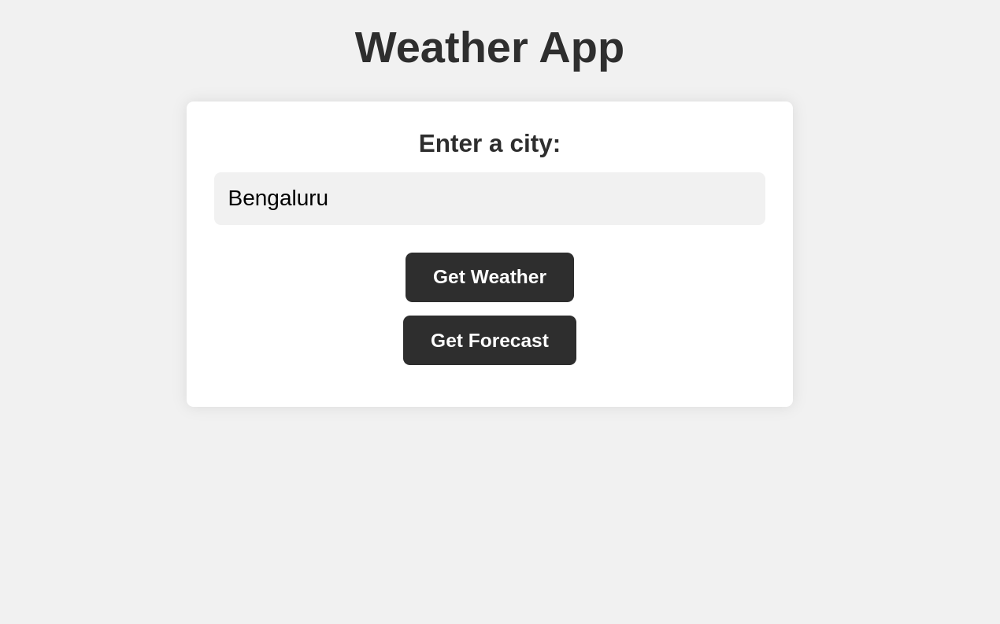

   

      <h1>Java Weather Web App Project</h1>
      
This project is a simple weather web application built using Spring Boot framework. The application provides users with the ability to retrieve weather information and forecast for a given city.

      <h2>Pages</h2>
      
The application has three main pages:

      <h3>1. Home Page</h3>
      
The Home page provides users with a form to enter the city name they want to retrieve weather information for. The page also contains two buttons for the user to either retrieve current weather information or forecast for the given city.

      

      <h3>2. Weather Page</h3>
      
The Weather page displays the current weather information for the city entered by the user on the Home page. The page includes weather details such as temperature, wind speed, humidity, and pressure.

      

      <h3>3. Forecast Page</h3>
      
The Forecast page displays the weather forecast for the next five days for the city entered by the user on the Home page. The page includes weather details such as temperature, wind speed, humidity, and pressure.

      

      <h2>Requirements</h2>
      <ul>
         <li>Java 8 or later</li>
         <li>Maven 3.2 or later</li>
      </ul>
      <h2>Installation</h2>
      <ol>
         <li>Clone the repository: <code>git clone https://github.com/Dominastorm/WeatherWebApp.git</code></li>
         <li>Navigate to the project directory: <code>cd WeatherWebApp</code></li>
         <li>Build and run the project using Spring Boot Dashboard extension on VS Code</li>
         <li>Access the application by navigating to <code>http://localhost:8080</code> in your web browser.</li>
      </ol>
      <h2>Configuration</h2>
      
The application uses the <a href="https://openweathermap.org/" target="_new">OpenWeatherMap API</a> to retrieve weather information. To use the API, you need to obtain an API key from the website and add it to the <code>application.properties</code> file.
      

      <pre>

<code class="!whitespace-pre hljs language-vbnet">weather.api.key=&lt;your-api-key&gt;
</code>

</pre>
      <h2>Technologies Used</h2>
      <ul>
         <li>Spring Boot</li>
         <li>Thymeleaf</li>
         <li>OpenWeatherMap API</li>
      </ul>
      <h2>Contributors</h2>
      <ul>
         <li><a href="https://github.com/Dominastorm" target="_new">Dhruv Chawla</a></li>
         <li><a href="https://github.com/DhruvSuvarna10" target="_new">Dhruv Suvarna</a></li>
         <li><a href="https://github.com/BlankSharma009" target="_new">Dhruv Sharma</a></li>
         <li><a href="https://github.com/AryanSharma2k2" target="_new">Aryan Sharma</a></li>
      </ul>
      <h2>License</h2>
      
This project is licensed under the MIT License - see the <a href="LICENSE" target="_new">LICENSE</a> file for details.

   

